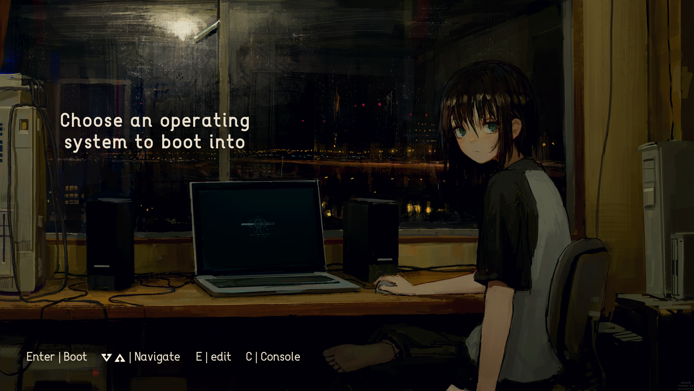

# GRUB theme
This is a grub theme that I customized to my liking from [this theme](https://github.com/Hitori-Laura/OsageChan_GRUB_theme) (thanks xd). If someone view this, I hope you like it! :)


If you want to have it you'll need to follow these steps first (I'm assuming that you have you OS functioning, so...)

### First clone the repository
```shell
git clone https://github.com/Kurami32/GRUB_theme.git
```
### Then copy the repository to this directory
```shell
sudo cp -r GRUB_theme /usr/share/grub/themes
```
### After this modify the grub config file
You can use you favorite editor, I'll use micro. (for save on micro is CTRL+S, and for exit CTRL+Q)
```shell
sudo micro /etc/default/grub
```
### Then search for this line
The line that says 'GRUB_THEME' should be there, uncomment it, and add the route of the theme that we copied. Should be look like this
```shell
GRUB_THEME="/usr/share/grub/themes/GRUB_theme/theme.txt"
```
### For the final step, update grub
```shell
sudo grub-mkconfig -o /boot/grub/grub.cfg
```

After this you can reboot your pc, and on grub you'll see this theme.

